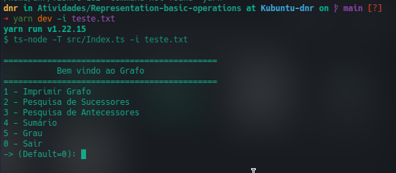
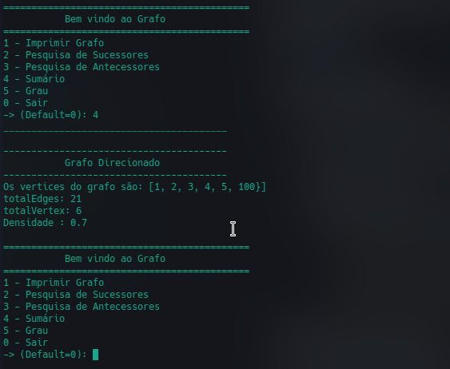

<h1 align="center">
Atividade 2: Distância de vértices e Propriedades do Grafo  

</h1>

## Sobre o Projeto

Algorítimo que implementa um grafo direcionado e exibe informações sobre o mesmo e informações exclusiva de determinado vértice.

## Requisitos

- [Node](https://nodejs.org/)

## Como Executar

- Instale as dependências com `npm install`
- Para o build do projeto usar `npm run build`
- Para execução em modo de desenvolvimento usar `npm run dev`

  ### Comandos inline

  Para geração do grafo é necessário passar como parâmetro um arquivo `.txt` precedido de `-i`.

  - Para execução em modo desenvolvimento

    `npm run dev -i exemplo.txt`

  - Para execução em modo produção

  - `npm run run:build -i exemplo.txt`

  - `npm run run:build -s -i exemplo.txt` -- com esse comando será executado apenas a parte relaciona a propriedade do grafo e distância entre vértices.

## Utilizando Programa

- No console basta informar a opção desejada conforme o menu apresentará.

## Exemplo de Utilização

### Menu que será exibido

 

 
 

### Após a escolha da opção para exibir o sumário

 

---

Projeto [Graph-FloydWarshall](https://github.com/dienerld/Graph/tree/floydWarshall/Representation-basic-operations)

Feito por [Diener Dornelas](https://github.com/dienerld)
